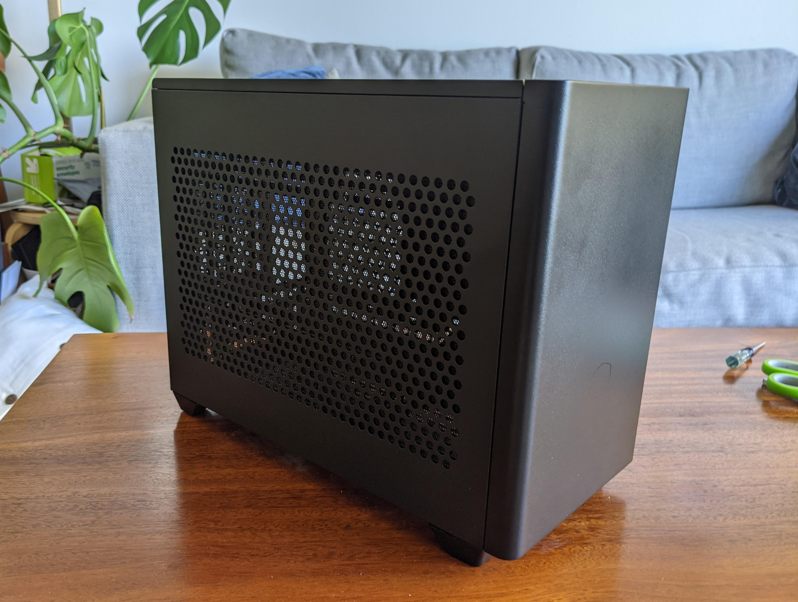
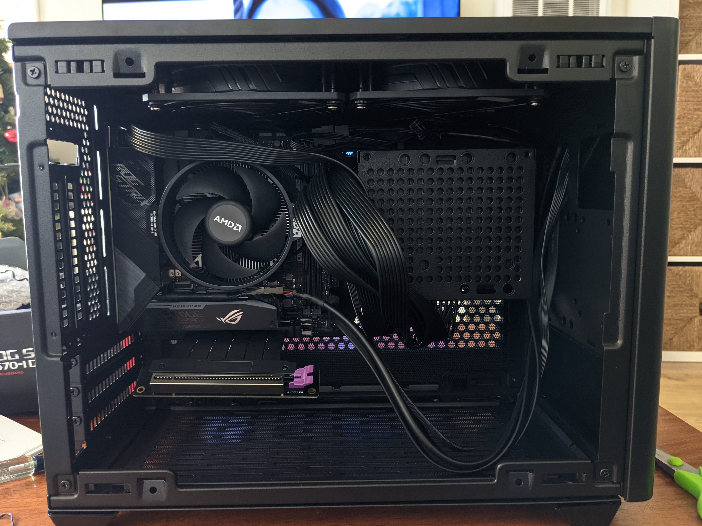

It has more than a decade since I last built a computer. In that time a lot has changed and a lot has stayed the same.

Last time I build a computer it involved spending a couple hours searching catalogs online for parts and then eventually going to Fry's Electronics to try to find the parts or equivalent within budget. Today it is so much easier to plan your build and be confident that the parts that you picked will not only be compatible but also fit using [PCPartPicker.com](https://pcpartpicker.com/). Long gone are the days of buying some RAM to realize you got the wrong type.

# Goal
My primary goal for this computer build is to allow me to better manage and edit my growing photo library. My second goal is that I also want to be able to play some video games (mostly simulation) like Cities Skylines or Flight Simulator 2020. My tertiary goal is size. Living in an apartment in San Francisco sizes matters. I am already taking up a lot of space in our living room with my desk and work area. My desk's area is also already pretty full with an external monitor, Synology NAS, Intel NUC running Linux for Plex Media Server and some other self hosted services, laser printer and a UPS (uninterpretable power supply).

# Parts

## Case (Cooler Master MasterBox NR200 Mini ITX)
I wanted to get a simple case that was compact, but also didn't limit what parts I could get. After some searching and checking out what people were building on [r/sffpc](https://www.reddit.com/r/sffpc/) the NR200 was one that kept appearing in a lot of builds.

I was hesitant to go with a cheap case as it was one thing I regretted in previous builds, but this case has so far been amazing. I really appreciate how modular it is and how you can take apart almost everything for better access with either no screws or just one or two. It feels solid and doesn't feel cheap at all. 

## CPU (AMD Ryzen 5 3600 3.6 GHz 6-Core Processor)
Last time I built a computer Intel was the clear market leader unless you were building a budget machine then you would go with AMD. That seems to have changed at some point and not AMD appears to be the clear first choice for most custom builders today. The Ryzen 5 3600 seems like the perfect balance of performance and cost. This might be one of the components I plan to upgrade down the road, but this should be more than enough until the Ryzen 9 or the Ryzen 7 become a bit cheaper.

## Motherboard (Asus ROG Strix X570-I Gaming Mini ITX AM4)
When choosing a motherboard I wanted to have USB 3.2 available for the case's front panel. I also wanted to maximize the amount of RAM I could install. I don't really care for the LEDs or lighting inside the computer and plan to disable it all (maybe).

## Memory (Corsair Vengeance LPX 32 GB (2 x 16 GB) DDR4-3200 CL16)
I was originally planning on maxing out the motherboard with 64GB of RAM, but it turned out to be more expensive than I was expecting. I was then going to buy a single 32GB or RAM, but got talked out of it by my friends. For the time being 32GB will be more than enough until price comes down.

## Storage (Samsung 970 EVO Plus 1 TB M.2-2280 NVME Solid State Drive)
Fast, fast, fast. That is what I wanted for the drive that will have my OS and applications on it. This was on sale when I bought it although I would have liked to get the 2TB model I am not willing to spend more than $300 for it. 

Also I am do not really _need_ the extra storage space. Although this machine is for photo editing and my library is already beyond 3TB of photos I have a Synology NAS with 16TB on it that I plan to mount. My Lightroom and Capture One catalogs will comfortable fit on 1TB for now and if they get to the point that they don't I can pick up a 

## Video Card (Gigabyte Radeon RX 580 8 GB GAMING 8G)
This is not the most powerful card by a long shot. As of January 2021 it holds a ranking of 30.9% on [Tom's Hardware GPU Rankings](https://www.tomshardware.com/reviews/gpu-hierarchy,4388.html). The card I would have liked to get would have been the Nvidia GeForce RTX 3060 Ti, but demand is far exceeding supply. I have added myself to a waitlist and will likely upgrade this. For now this video card is more than capable.

## Power Supply (Corsair SF 600 W 80+ Platinum Certified Fully Modular SFX)
The only thing I was looking for here was that it was fully modular. My last build didn't have this (I don't even know if it was an option back then) and I will not go back.

## Cable Management
It has been some time since I have build a computer and my cable management has gotten a bit sloppy.

I am looking into eventually upgrading to custom cables from [pslate customs](https://www.pslatecustoms.com/collections/cooler-master-nr200-cables). These cables are a bit expensive, but I like that they are the correct length and built for my case. This will make for a clean look inside the case and maybe I will actually use the window on the case. 

# Setup
I like to plan out my setup and document as much as possible so that I can replicate it later. That [full document is here](/notes/windows-setup/) and I will do my best to update when things change. 

